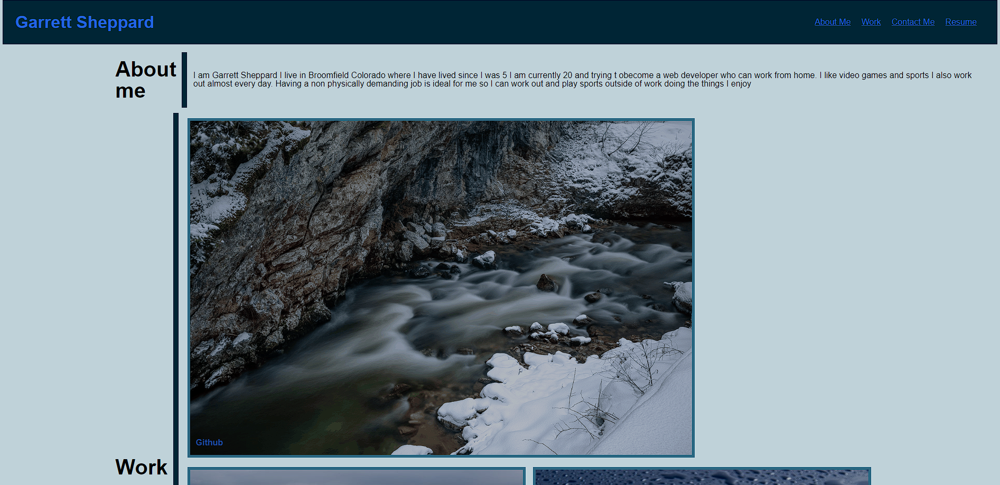

# Personal-portfolio
## deployed link
https://gmoney3303.github.io/Personal-portfolio/
## Description

this project is a website of my own personal portfolio. It will explain a little about me then it will give a list of my projects and contact info.
ALl of which you will be able to click to and acces. In the website you will be able to click to get to contact info work and about me then click ont the links about my work 
to go to an external link on my work. I learned a lot more on how to structure websites and how to use css in conjuction with html.
Another thing I learned is to better sketch things out I used way more divs than I thought I would and had to add them in after I had already wrote a lot of code causing thimgs to get messy.

## Usage

## Credits

List your collaborators, if any, with links to their GitHub profiles.

If you used any third-party assets that require attribution, list the creators with links to their primary web presence in this section.

If you followed tutorials, include links to those here as well.

## License

Mit license

## Features

hoverable images that also have links they lead to when clicked on.
clicking on the "about me,work" in the top right will dirrect you to that part of the page.

[def]: assets/images/personal.PNG